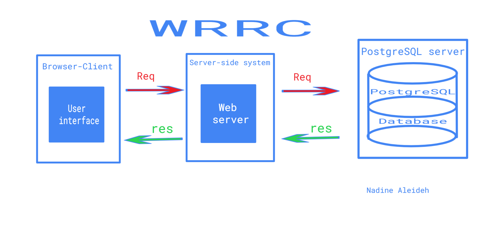

# Movies-Library

# Movies-Library - Project Version 4.0

**Author Name**: Nadine Aleideh

## WRRC

## Overview

This project is a movie app that can check the latest movies based on categories, trending items, search for a movie, popular tv shows, popular people. And in this third version of the project I'm creating a new style of storage which is database using the **postgresSQL server** to store in the database any moive information that any client want and to retrive these moives from the database and updating it, so I did a request and connection from my server to the **postgresSQL server** to ables me doing these stuff.

## Getting Started

 The steps that you must take on your terminal in order to build this app on your own machine and get it running:

 1. Clone this repository using the SSH link .

 2. Go to the **package-lock.json** then check the equired packages in **dependencies object** in order to install them ***npm install package1Name   package2Name ...*** like: ***npm install axios dotenv cors pg***.

 3. Run ***npm start*** in order to start the server running.

 4. Advise you to Run  ***npm i -g nodemon*** for the first time and Run ***nodemon*** to atuo RE-Run the server insted of run ***npm start*** each time after making any changes in the **server.js file**.

 5. To start postgerSQL server type: ***sqlstart*** and To stop it type: ***sqlstop***.

 6. To open postgerSQL shell server (SSL mode) type: ***psql*** and To quit it type: ***\q*** .

 7. After open postgerSQL shell server creat a database and pass its name in the server.js file at this line **const client = new pg.Client('postgresql://localhost:5432/***Your-db-name***')** and, Run this command in the CLI of our server ***psql -d ***Your-db-name*** -f schema.sql;***.

 8. You can google the queries syntax you would to use, and you can check this [Link](https://hasura.io/blog/top-psql-commands-and-flags-you-need-to-know-postgresql/) to handle with the postgerSQL shell server (SSL mode).

## Project Features

- I configured a trending items Page Endpoint **localhost:3000/trending** this page displays all (Include all movies, TV shows and people in the results as a global trending list) weekly(View the trending list for the week) trending items from(TMDB) 3rd party API.

- I configured a search Page Endpoint **localhost:3000/search** this page displays the results of search for a movie with query "the" on (TMDB) 3rd party API.

- I configured a top rated movies Page Endpoint **localhost:3000/topRated** this page displays the top rated movies on (TMDB)3rd party API.

- I configured an upcoming movies Page Endpoint **localhost:3000/upcoming** this page displays a list of upcoming movies in theatres on (TMDB) 3rd party API.

- I configured a popular tv shows Page Endpoint **localhost:3000/tvShowsPopular** this page displays a list of the current popular TV shows on (TMDB) 3rd party API.

- I configured a popular people Page Endpoint **localhost:3000/popularPeople** this page displays the list of popular people on (TMDB) 3rd party API.

- I configured error handlers:

  1.  to handle the server error (status 500).
  2.  to handle "page not found error" (status 404).   
  

- I configured a post request to save a specific movie to database along with my personal comments by using this url in the thunder **localhost:3000/addMovies**.

- configured a movie Page Endpoint **localhost:3000/getMovies** this page will retrive all the movies stored in the database.

- The **new** configration that I added is a delete request to delete a specific movie from the database by its ID, by typing in the url **localhost:3000/getMovies/:id'**. For example if you typed in the url : **localhost:3000/getMovies/1** it will delete the movie with the id =1 .

- I configured a movie Page Endpoint **localhost:3000/getMoviesById** this page will retrive a specific movie by its ID from the database. For example if you typed in the url : **localhost:3000/getMoviesById/id=1** it will retrive the movie with the id =1 .

- Also I configured a movie Page Endpoint **localhost:3000/getMovies/:id'** it is an update request to update your comments for a specific movie in the database. For example if you typed in the url :  **localhost:3000/getMovies/1** it will update the movie with the id =1 .