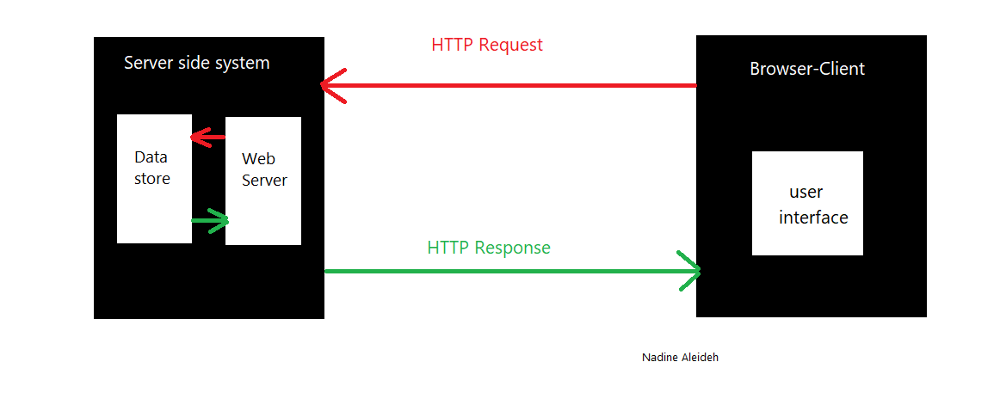

# Movies-Library

# Movies-Library - Project Version 2.0

**Author Name**: Nadine Aleideh

## WRRC

## Overview

This project is a movie app that can check the latest movies based on categories, trending items, search for a movie, popular tv shows, popular people. And in this second version of the project I'm featching the data to display in our server from the (TMDB) 3rd party API, so I did a request from my server to the (TMDB) 3rd party API server to git the data.

## Getting Started

 The steps that you must take on your terminal in order to build this app on your own machine and get it running:

 1. Clone this repository
 2. Run ***npm init -y***
 3. Run ***npm install***
 4. Run ***npm install axios dotenv cors***
 5. Run ***npm start*** in order to start the server running.
 6. Advise you to Run  ***npm i -g nodemon*** for the first time and Run ***nodemon*** to atuo RE-Run the server insted of run ***npm start*** each time after making any changes in the **server.js file**
 7. If you want to make changes and get new data => You must go to this website [THE MOVIE DB](https://developers.themoviedb.org/3/getting-started) and :
    - Create a new account if you don’t have one.
    - Get your API key.

## Project Features

- I configured a trending items Page Endpoint **localhost:3000/trending** this page displays all (Include all movies, TV shows and people in the results as a global trending list) weekly(View the trending list for the week) trending items from(TMDB) 3rd party API.

- I configured a search Page Endpoint **localhost:3000/search** this page displays the results of search for a movie with query "the" on (TMDB) 3rd party API.

- I configured a top rated movies Page Endpoint **localhost:3000/topRated** this page displays the top rated movies on (TMDB)3rd party API.

- I configured an upcoming movies Page Endpoint **localhost:3000/upcoming** this page displays a list of upcoming movies in theatres on (TMDB) 3rd party API.

- I configured a popular tv shows Page Endpoint **localhost:3000/tvShowsPopular** this page displays a list of the current popular TV shows on (TMDB) 3rd party API.

- I configured a popular people Page Endpoint **localhost:3000/popularPeople** this page displays the list of popular people on (TMDB) 3rd party API.

- I configured error handlers:

  1.  to handle the server error (status 500).
  2.  to handle "page not found error" (status 404).